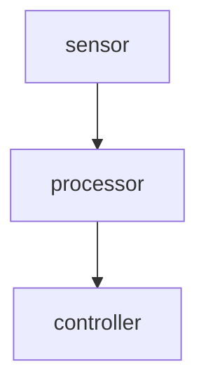

> 🌐 **[English](../../operations/debugging.md)**

# 调试与可观测性指南

本指南介绍如何调试、录制、回放和监控 adora 数据流。面向希望了解数据流出了什么问题、测量性能或离线重现问题的新用户。

---

## 目录

- [前提条件](#前提条件)
- [快速调试检查清单](#快速调试检查清单)
- [录制与回放](#录制与回放)
- [节点管理](#节点管理)
- [主题检查](#主题检查)
- [运行时参数](#运行时参数)
- [环境诊断](#环境诊断)
- [追踪检查](#追踪检查)
- [资源监控](#资源监控)
- [日志分析](#日志分析)
- [数据流可视化](#数据流可视化)
- [监控运行中的数据流](#监控运行中的数据流)
- [端到端调试工作流](#端到端调试工作流)

---

## 前提条件

使用主题检查命令（`topic echo`、`topic hz`、`topic info`）之前，需要使用以下任一方式启用调试消息发布：

**方式 1：CLI 标志（推荐）**

```bash
adora start dataflow.yml --debug
adora run dataflow.yml --debug
```

**方式 2：YAML 描述符**

```yaml
_unstable_debug:
  publish_all_messages_to_zenoh: true
```

这告诉 daemon 将所有节点间消息发布到 Zenoh，coordinator 可以通过 WebSocket 代理到 CLI 客户端。不使用此标志时，主题检查命令将返回错误。

`record`、`replay`、`logs`、`list`、`top`、`graph`、`node info/restart/stop`、`param` 和 `doctor` 命令**不**需要此标志。`topic pub` 命令需要此标志。

---

## 快速调试检查清单

当出现问题时，按以下顺序操作：

```bash
# 1. 运行完整环境诊断
adora doctor --dataflow dataflow.yml

# 2. 查看活跃的数据流
adora list

# 3. 检查问题节点
adora node info -d my-dataflow problem-node

# 4. 检查节点资源使用
adora top

# 5. 流式查看问题节点的日志
adora logs my-dataflow problem-node --follow --level debug

# 6. 节点是否在产生输出？
adora topic echo -d my-dataflow problem-node/output

# 7. 注入测试数据
adora topic pub -d my-dataflow problem-node/input '[1, 2, 3]'

# 8. 是否以预期频率发布？
adora topic hz -d my-dataflow --window 5

# 9. 检查/修改运行时参数
adora param list -d my-dataflow problem-node
adora param set -d my-dataflow problem-node debug_level 2

# 10. 重启行为异常的节点（不停止数据流）
adora node restart -d my-dataflow problem-node

# 11. 查看 coordinator 追踪（无需外部基础设施）
adora trace list
adora trace view <trace-id-prefix>

# 12. 可视化数据流图
adora graph dataflow.yml --open

# 13. 录制用于离线分析
adora record dataflow.yml -o debug-capture.adorec
```

---

## 录制与回放

录制捕获实时数据流消息到文件。回放用录制的数据替代源节点，让你无需硬件即可重现行为。

### 录制数据流

```bash
# 录制所有主题（默认输出：recording_{timestamp}.adorec）
adora record dataflow.yml

# 指定输出文件
adora record dataflow.yml -o my-capture.adorec
```

这会在数据流中注入一个隐藏的 `__adora_record__` 节点，订阅所有节点输出并写入 `.adorec` 文件。录制节点二进制（`adora-record-node`）在首次使用时自动构建。

录制运行直到按 Ctrl-C 或数据流停止。

### 录制特定主题

```bash
# 仅录制相机和激光雷达
adora record dataflow.yml --topics sensor/image,lidar/points
```

主题名使用格式 `node_id/output_id`。可用主题可通过 `adora topic list -d <dataflow>` 发现。

### 代理录制（远程 / 无磁盘）

当目标机器没有本地磁盘或你想在本地机器上录制时：

```bash
# 先启动数据流（分离模式）
adora start dataflow.yml --detach

# 通过 WebSocket 代理录制 -- 数据通过 coordinator 流到 CLI
adora record dataflow.yml --proxy -o capture.adorec

# 通过代理录制特定主题
adora record dataflow.yml --proxy --topics sensor/image,lidar/points
```

代理模式工作原理：
1. 数据流必须已在运行（`adora start --detach`）
2. CLI 通过 WebSocket 连接到 coordinator
3. coordinator 代替 CLI 订阅 Zenoh
4. 消息数据通过 WebSocket 二进制帧流到 CLI
5. CLI 在本地写入 `.adorec` 文件

这需要描述符中的 `publish_all_messages_to_zenoh: true`。

**何时使用 `--proxy`：**
- 没有本地磁盘的嵌入式目标
- 想要将录制放在工作站上的远程机器
- 仅有 WebSocket 连接（没有直接 Zenoh 访问）

**何时使用默认模式（不使用 `--proxy`）：**
- 同一机器或共享文件系统
- 高吞吐量场景（无 WebSocket 开销）
- 不需要 `publish_all_messages_to_zenoh`

### 回放录制

```bash
# 以原始速度回放
adora replay recording.adorec

# 以 2 倍速回放
adora replay recording.adorec --speed 2.0

# 尽可能快地回放（速度 0）
adora replay recording.adorec --speed 0
```

回放工作原理：
1. 读取 `.adorec` 文件头以获取原始数据流描述符
2. 识别哪些节点产生了录制数据
3. 用 `adora-replay-node` 实例替换这些源节点
4. 运行修改后的数据流 -- 下游节点接收的回放数据与实时数据完全相同

回放节点二进制（`adora-replay-node`）在首次使用时自动构建。

### 回放选项

| 标志 | 默认值 | 描述 |
|------|--------|------|
| `--speed <FLOAT>` | `1.0` | 播放速度倍数。`2.0` = 2 倍速，`0.5` = 半速，`0` = 尽可能快 |
| `--loop` | 关闭 | 连续循环播放 |
| `--replace <NODES>` | 所有已录制 | 逗号分隔的要替换的节点列表 |
| `--output-yaml <PATH>` | - | 写出修改后的描述符 YAML 而不运行 |

### 选择性回放

仅替换特定源节点，保持其他节点实时运行：

```bash
# 仅替换传感器节点，保持相机实时
adora replay recording.adorec --replace sensor

# 替换传感器和激光雷达，其他保持实时
adora replay recording.adorec --replace sensor,lidar
```

当你想用已知输入数据调试特定处理管道同时保持系统其他部分实时运行时很有用。

### 试运行（输出 YAML）

录制和回放都支持 `--output-yaml` 来查看修改后的描述符而不运行：

```bash
# 查看录制注入的描述符
adora record dataflow.yml --output-yaml record-modified.yml

# 查看回放修改的描述符
adora replay recording.adorec --output-yaml replay-modified.yml
```

### 录制文件格式

`.adorec` 格式是一个简单的二进制文件：

```
┌──────────────────────────────────┐
│ 头部 (bincode)                   │
│   version: u32                   │
│   start_nanos: u64               │
│   dataflow_id: Uuid              │
│   descriptor_yaml: Vec<u8>       │
├──────────────────────────────────┤
│ 条目 1 (bincode)                 │
│   node_id: String                │
│   output_id: String              │
│   timestamp_offset_nanos: u64    │
│   event_bytes: Vec<u8>           │
├──────────────────────────────────┤
│ 条目 2 ...                       │
├──────────────────────────────────┤
│ ...                              │
├──────────────────────────────────┤
│ 尾部 (bincode)                   │
│   total_messages: u64            │
│   total_bytes: u64               │
└──────────────────────────────────┘
```

`event_bytes` 字段包含原始的 `Timestamped<InterDaemonEvent>` bincode 有效载荷 -- 与 daemon 间线路格式相同。头部中的 `descriptor_yaml` 存储原始数据流描述符，以便回放可以重建数据流。

---

## 节点管理

### 节点信息

获取特定节点的详细信息，包括状态、输入、输出、指标和重启次数：

```bash
adora node info -d my-dataflow camera

# JSON 输出
adora node info -d my-dataflow camera --format json
```

### 节点重启

重启单个节点而不停止整个数据流。适用于恢复行为异常的节点或应用配置更改：

```bash
# 使用默认优雅期重启
adora node restart -d my-dataflow camera

# 使用自定义优雅期重启
adora node restart -d my-dataflow camera --grace 10s
```

daemon 发送停止事件，等待优雅期，然后重新生成节点进程。

### 节点停止

停止单个节点而不停止整个数据流：

```bash
adora node stop -d my-dataflow camera

# 使用自定义优雅期
adora node stop -d my-dataflow camera --grace 5s
```

---

## 主题检查

主题检查命令通过 coordinator 的 WebSocket 代理订阅实时数据流消息。需要 `--debug` 标志或 `publish_all_messages_to_zenoh: true`。

### 列出主题

```bash
# 列出运行中数据流的所有主题
adora topic list -d my-dataflow

# JSON 输出
adora topic list -d my-dataflow --format json
```

显示每个输出、哪个节点发布它以及哪些节点订阅它。此命令从描述符读取，**不**需要 `publish_all_messages_to_zenoh`。

### 回显主题数据

实时将主题数据流到终端：

```bash
# 回显单个主题
adora topic echo -d my-dataflow camera_node/image

# 回显多个主题
adora topic echo -d my-dataflow robot1/pose robot2/vel

# JSON 输出（适合管道到 jq 或其他工具）
adora topic echo -d my-dataflow robot1/pose --format json

# 回显所有主题
adora topic echo -d my-dataflow
```

每行显示主题名、Arrow 数据内容和元数据参数。使用 `--format json` 获取机器可读输出：

```json
{"timestamp":1709000000000,"name":"robot1/pose","data":[1.0,2.0,3.0],"metadata":null}
```

### 测量频率

显示每个主题发布频率的交互式 TUI：

```bash
# 所有主题，10 秒滑动窗口
adora topic hz -d my-dataflow --window 10

# 特定主题，5 秒窗口
adora topic hz -d my-dataflow robot1/pose robot2/vel --window 5
```

TUI 显示：
- 平均频率 (Hz)
- 平均、最小、最大间隔
- 标准差
- 显示近期活动的迷你图

按 `q` 或 Ctrl-C 退出。需要交互式终端。

### 发布测试数据

向运行中的数据流注入数据进行测试。需要 `publish_all_messages_to_zenoh: true`。

```bash
# 发布单个 Arrow 数组
adora topic pub -d my-dataflow sensor/threshold '[42]'

# 从 JSON 文件发布
adora topic pub -d my-dataflow sensor/config --file test-config.json

# 发布多条消息
adora topic pub -d my-dataflow sensor/trigger '[1]' --count 10
```

适用于：
- 用已知输入数据测试节点行为
- 触发下游节点中的特定代码路径
- 无需硬件模拟传感器输入

### 主题元数据和统计

一次性统计收集：

```bash
# 收集 5 秒统计（默认）
adora topic info -d my-dataflow camera_node/image

# 收集 10 秒
adora topic info -d my-dataflow camera_node/image --duration 10
```

报告：
- Arrow 数据类型
- 发布者节点
- 订阅者节点（来自描述符）
- 消息数量和带宽
- 发布频率

---

## 运行时参数

运行时参数允许你在数据流运行期间读取和修改节点配置，无需重启。参数存储在 coordinator 中，可选择转发到运行中的节点。

```bash
# 列出节点的所有参数
adora param list -d my-dataflow detector

# 获取单个参数
adora param get -d my-dataflow detector confidence

# 设置参数（值为 JSON）
adora param set -d my-dataflow detector confidence 0.8
adora param set -d my-dataflow detector config '{"nms": 0.5, "classes": ["car", "person"]}'

# 删除参数
adora param delete -d my-dataflow detector confidence
```

参数持久化在 coordinator 存储中（内存或 redb）。当节点运行时，`param set` 也会将新值转发到节点的 daemon。节点可以通过节点事件流读取参数。

**限制：** 键最大 256 字节，值序列化后最大 64KB。

---

## 环境诊断

`adora doctor` 对你的环境执行全面健康检查：

```bash
# 基本诊断
adora doctor

# 诊断 + 数据流验证
adora doctor --dataflow dataflow.yml
```

执行的检查：
1. Coordinator 可达性
2. 已连接 daemon 状态
3. 活跃数据流健康
4. 数据流 YAML 验证（如果提供了 `--dataflow`）

在调试任何问题时作为第一步使用，或在 CI 中运行测试前验证环境。

---

## 追踪检查

coordinator 从 `adora_coordinator` 和 `adora_core` crate 在内存中捕获 tracing span（环形缓冲区最多 4096 个 span）。你可以在不需要任何外部追踪基础设施（无需 Jaeger、Tempo 等）的情况下查看这些追踪。

### 列出追踪

```bash
adora trace list
```

显示所有捕获的追踪及其根 span 名称、span 数量、开始时间和总时长：

```
TRACE ID      ROOT SPAN          SPANS  STARTED              DURATION
a1b2c3d4e5f6  spawn_dataflow     12     2026-03-01 10:30:05  1.234s
f8e7d6c5b4a3  build_dataflow     5      2026-03-01 10:29:58  0.500s
```

### 查看追踪

```bash
# 完整追踪 ID
adora trace view a1b2c3d4-e5f6-7890-abcd-1234567890ab

# 或使用唯一前缀
adora trace view a1b2c3d4
```

以缩进树形式显示 span，展示父子关系、日志级别、时长和 span 字段：

```
spawn_dataflow [INFO 1.234s] {build_id="abc", session_id="def"}
  build_dataflow [INFO 0.500s]
    download_node [DEBUG 0.200s] {url="..."}
  start_inner [INFO 0.734s]
    spawn_node [INFO 0.100s] {node_id="camera"}
    spawn_node [INFO 0.080s] {node_id="detector"}
```

### 何时使用追踪检查

- **快速调试** -- 无需设置 Jaeger/Tempo 即可查看 coordinator 在 `start`、`stop` 或 `build` 期间做了什么
- **性能分析** -- 识别数据流生命周期操作中的慢 span
- **部署故障排除** -- 了解 coordinator 操作的顺序和时间

对于跨 daemon 和节点的完整分布式追踪，设置 `ADORA_OTLP_ENDPOINT` 并使用兼容 OTLP 的后端。

---

## 资源监控

`adora top`（也称 `adora inspect top`）提供显示每节点资源使用的实时 TUI：

```bash
# 默认 2 秒刷新
adora top

# 自定义刷新间隔
adora top --refresh-interval 5

# JSON 快照用于脚本/CI
adora top --once | jq .
```

为每个节点显示：
- CPU 使用率（单核百分比）
- 内存（RSS）
- 节点状态（Running、Restarting、Degraded、Failed）
- 重启次数
- 队列深度（待处理消息）
- 网络 TX/RX（通过 Zenoh 跨 daemon 的字节）
- 磁盘 I/O 读/写

指标由 daemon 收集并报告给 coordinator，因此适用于跨多台机器的分布式数据流。按 `q` 或 Ctrl-C 退出。

使用 `--once` 打印单个 JSON 快照并退出，适合 CI 管道和监控集成。

注意：CPU 百分比按每核计算，因此多线程节点的值可以超过 100%。不同机器上的节点可能有不同的 CPU，因此百分比在不同机器间不能直接比较。

---

## 日志分析

### 实时日志流

```bash
# 流式查看特定节点的日志
adora logs my-dataflow sensor-node --follow

# 流式查看所有节点的日志
adora logs my-dataflow --all-nodes --follow

# 按日志级别过滤
adora logs my-dataflow sensor-node --follow --level debug

# 带 grep 过滤的流式传输
adora logs my-dataflow --all-nodes --follow --grep "error"
```

不使用 `--follow` 时，从本地日志文件读取。使用 `--follow` 时，通过 WebSocket 从 coordinator 实时流式传输。

### 本地日志文件

日志存储在 `out/` 目录中：

```
out/
  <dataflow-uuid>/
    log_<node-id>.jsonl          # 当前日志
    log_<node-id>.1.jsonl        # 轮转的（上一个）
    log_<node-id>.2.jsonl        # 轮转的（更早）
```

直接读取：

```bash
# 所有节点，本地文件
adora logs --local --all-nodes

# 特定节点，最后 50 行
adora logs --local sensor-node --tail 50
```

### 过滤和搜索

| 标志 | 示例 | 描述 |
|------|------|------|
| `--level <LEVEL>` | `--level debug` | 最小级别：error、warn、info、debug、trace、stdout |
| `--log-filter <FILTER>` | `--log-filter "sensor=debug,processor=warn"` | 每节点级别过滤 |
| `--grep <PATTERN>` | `--grep "timeout"` | 不区分大小写的子串匹配 |
| `--since <DURATION>` | `--since 5m` | 仅此时间之后的日志 |
| `--until <DURATION>` | `--until 1h` | 仅此时间之前的日志 |
| `--tail <N>` | `--tail 100` | 显示最后 N 行 |
| `--log-format <FMT>` | `--log-format json` | 输出格式：pretty（默认）或 json |

环境变量：
- `ADORA_LOG_LEVEL` -- 默认日志级别
- `ADORA_LOG_FORMAT` -- 默认日志格式
- `ADORA_LOG_FILTER` -- 默认每节点过滤

---

## 数据流可视化

生成数据流的可视化图形：

```bash
# 生成 HTML 并在浏览器中打开
adora graph dataflow.yml --open

# 生成 Mermaid 图表文本
adora graph dataflow.yml --mermaid
```

Mermaid 输出可以粘贴到 [mermaid.live](https://mermaid.live/) 或在 GitHub markdown 中使用：

````markdown

````

HTML 模式生成一个包含交互式 mermaid.js 图表的独立文件。

---

## 监控运行中的数据流

```bash
# 完整环境诊断
adora doctor

# 列出所有数据流（活跃和已完成）
adora list

# 列出特定数据流中的节点
adora node list -d my-dataflow

# 获取特定节点的详细信息
adora node info -d my-dataflow camera

# 检查 coordinator/daemon 状态
adora status

# 查看/修改运行时参数
adora param list -d my-dataflow detector
adora param set -d my-dataflow detector threshold 0.5
```

`adora list` 显示每个数据流的 UUID、名称、状态和节点数量。使用 `-d <name>` 配合其他命令来定位特定数据流。

---

## 端到端调试工作流

### 工作流 1：节点未产生输出

```bash
# 1. 验证节点正在运行
adora list
adora top

# 2. 检查其日志
adora logs my-dataflow problem-node --follow --level trace

# 3. 检查上游节点是否在发布
adora topic echo -d my-dataflow upstream-node/output

# 4. 验证主题连线
adora topic list -d my-dataflow
adora graph dataflow.yml --open
```

### 工作流 2：意外数据或错误值

```bash
# 1. 回显主题查看原始数据
adora topic echo -d my-dataflow node/output --format json

# 2. 录制用于离线分析
adora record dataflow.yml -o debug.adorec

# 3. 用已知输入回放以隔离问题
adora replay debug.adorec --replace sensor --speed 0
```

### 工作流 3：性能问题

```bash
# 1. 检查每节点 CPU/内存
adora top

# 2. 测量发布频率
adora topic hz -d my-dataflow --window 10

# 3. 获取疑似瓶颈的带宽统计
adora topic info -d my-dataflow heavy-node/output --duration 10

# 4. 录制并以最大速度回放以找到吞吐量限制
adora record dataflow.yml -o perf.adorec
adora replay perf.adorec --speed 0
```

### 工作流 4：重现现场问题

```bash
# 在机器人/目标机器上：
adora start dataflow.yml --detach
adora record dataflow.yml --proxy -o field-capture.adorec

# 将 .adorec 文件传输到工作站，然后：
adora replay field-capture.adorec
adora replay field-capture.adorec --speed 0.5  # 慢动作
adora replay field-capture.adorec --loop        # 连续回放
```

### 工作流 5：远程调试（无直接访问）

当你仅有到 coordinator 的 WebSocket 连接时：

```bash
# 所有这些命令通过 WebSocket 工作 -- 不需要 Zenoh
adora list
adora top
adora logs my-dataflow --all-nodes --follow
adora topic echo -d my-dataflow node/output
adora topic hz -d my-dataflow
adora record dataflow.yml --proxy -o remote-capture.adorec
```

---

## 另见

- [CLI 参考](cli.md) -- 完整命令参考
- [WebSocket 控制平面](websocket-control-plane.md) -- CLI 如何与 coordinator 通信
- [WebSocket 主题数据通道](websocket-topic-data-channel.md) -- 主题数据如何被代理
- [测试指南](testing-guide.md) -- 运行冒烟测试
